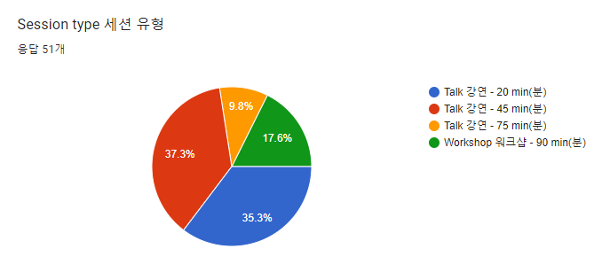

---
title: "Call for talks and workshop is now closed"
date: 2022-09-29T00:00:00+09:00
authors:
    - name: Youngbin Han
      bio: Organizer, Ubucon Asia 2022 / Leader, Ubuntu Korea Community 
      email: youngbin@ubuntu-kr.org
      launchpad: sukso96100
      github: sukso96100
      profile: https://avatars2.githubusercontent.com/u/1916739?s=460&v=4
      linkurl: https://youngbin.xyz
      linklabel: Website
---

Our call for talks and workshop for this year's UbuCon Asia is now closed! 
Thank you every applicants for making your time on choosing topics and writing proposal for our event.

Our content team will start reviewing submitted proposal from today to Oct 12.
Once we complete reviewing, We'll notify every applicants wheather proposal is accepted, pending or rejected by the email applicants entered when submitting proposal.
Then you will receive an email from content@ubucon.asia. If your proposal is accepted, We'll provide a link to from to submit your profile. Your participation will be confirmed by submitting that form.

If you submitted proposals and coming from overseas or non-capital area of Korea, have a look at our travel sponsorship and travel grants information from [this page](../../venue-and-travel/travel-sponsorship/) and make sure to apply for our travel sponsorship if you need.

## Some overview of submitted proposal

We received 51 proposals this year! Note that this doesn't include lightning talks and BoFs yet.

  
To summarize proposals by session types, 20min and 45min Talks are the most proposals submitted this year.  
| Session type | Number of proposals |
| -- | -- |
| Talk 20min | 18 |
| Talk 45min | 19 |
| Talk 75min | 5 |
| Workshop 90min | 9 |

  
By topic categories, Most proposals are *Cloud and Infrastructure(14 proposals)*, *Community, Diversity, Local Outreach and Social Context(14 proposals)* and *Desktop(6 proposals)* topics.

## Questions?

If you have any questions, feel free to contact Content team (content@ubucon.asia) or Travel support team (travel@ubucon.asia).
You can also join us chat online via [IRC](https://web.libera.chat/#ubucon-asia), [Matrix](https://web.libera.chat/#ubucon-asia) or [Telegram](https://t.me/UbuConAsia).