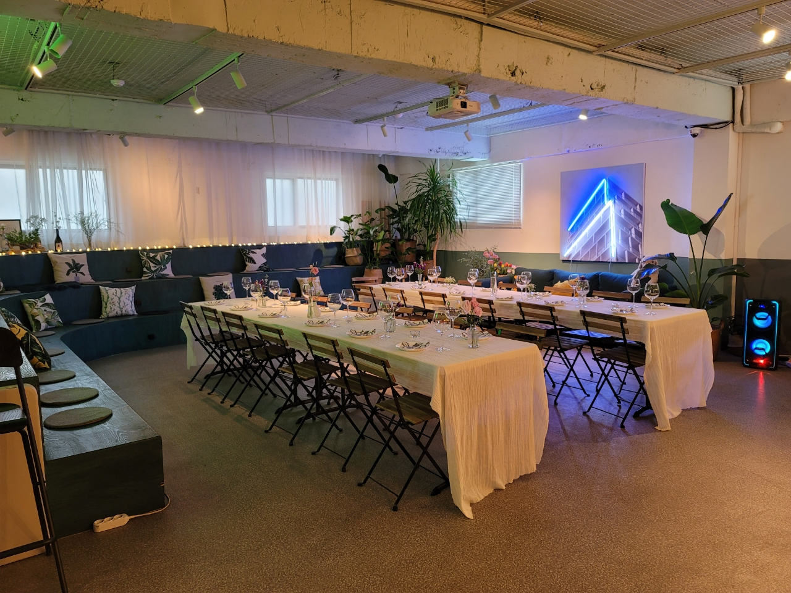
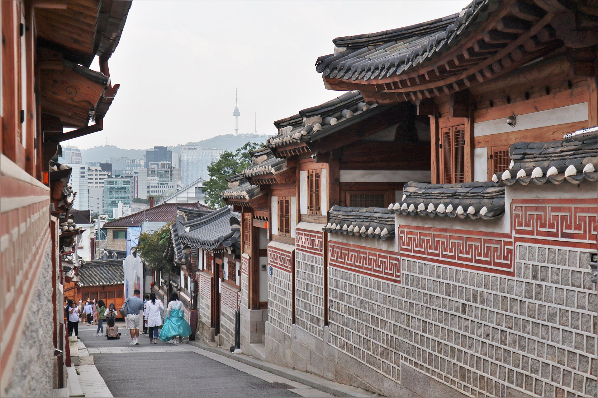

강연과 워크샵 등 컨퍼런스 일정이 UbuCon Asia 의 전부가 아닙니다. 준비위원회에서 준비한 부대행사에 참여하셔서 다른 참가자와 더 가까워지세요!
부대행사는 별도 티켓 구매가 필요하며, 수량이 한정되어 있습니다.

][티켓 구입 페이지](../tickets/) 에서 자세한 사항을 확인하세요.

## 컨퍼런스 저녁만찬

홍대 파티룸에서 발표자와 다른 커뮤니티 사람들과 즐거운 시간을 보내보세요! 다른 참석자와 함께 플래터와 각종 음료도 즐겨보세요!

- 일시: 11월 26일 오후 6:30 ~ 8:30
- 장소: 서울특별시 마포구 동교로 196 4층

## 그룹투어

서울의 아름다운 가을을 느낄 수 있는 투어이며, 경복궁, 한옥마을 방문과 공연 관람으로 구성된 가이드 투어 프로그램 입니다!

- 일시: 11월 28일 오후 1:00 ~ 7:30
- 장소: 스탠포드 호텔 서울 앞 집결(변동될 수 있음)

### 일정
- 1:00 PM / 버스 탑승
- 1:30 ~ 4:00 PM / 북촌한옥마을, 경복궁
- 5:00 ~ 6:30 PM / "페인터즈:히어로" 공연 관람
- 6:30 ~ 7:30 PM / 저녁식사
- 집결지로 복귀 및 일정 종료