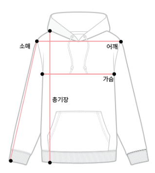

This year, we organize as paid event. The pricings are as follows. You may buy tickets at **Festa.io for Korean payment method** or **Tito.io for foreign payment method.** You can also participate online, there are no registration required unless you participate BoFs.

> Registration is now open!




## Conference tickets

- Early bird(For 2 days): 40,000 KRW (28 USD)
- List price(For 1 day): 30,000 KRW (21 USD)
- List price(For 2 days): 50,000 KRW (35 USD)
- Donation ticket(For 2 days): 100,000KRW (70 USD), 150,000 KRW (105 USD) or 200,000 KRW (140 USD)
    - Free conference dinner if you choose 150,000 KRW (105 USD) or more
- Online: Free (Registration required for participating BoFs)

### What's included?
- In-person tickets: You can join Talks(Lectures), Workshops, BoF and sponsor booth at the venue. Some swags and Simultaneous interpretation between Korean and English (Only on Intl room) provided.
- Online tickets: Join Talk sessions via live streaming (Only for Intl room session without interpretation), and participate BoF with Video call.

### Discounts or free tickets
We offer some discounts or free tickets for eligible participants. See [*Ticket discount promotion*](../news/2022-11-18-tickets-promotions/) for details.

## Tickets for Social events

- Conference dinner(At Day 1 evening): 36,000 KRW (25 USD)
- Group tour(At November 28th afternoon): 30,000 KRW (21 USD)

## About 3rd party data provision consent
If you consent to 3rd party data provision at registration, We may share your personal data with our sponsors. And sponsors may send you email for marketing purpose. See our [privacy policy](../privacy-policy) to learn more.

## Refund policy

You can only request to refund during ticket selling periods. Refund is not allowed from November 14.
If you could not refund your ticket within refund periods. For tickets from Festa.io, You can transfer by sharing QR codes. [And for Tito.io, You may use "Re-assign" to transfer your ticket](https://help.tito.io/en/articles/3586025-how-do-i-re-assign-my-ticket)

## Volunteer!

If you got your ticket, You can apply to become our volunteer!



## Hoodie info

> Note: Hoodie are only for Speakers, Organizers, Volunteers, Patrons, etc. 

| Size(CM) | Shoulder(어깨) | Chest(가슴) | Height(총기장) | Arm length(소매길이) |
| -- | -- | -- | -- | -- |
| 13호(2~3세,110) |	- |	33 | 44 | - |
| 14호(4~5세,120) |	- |	35 | 46 | - |
| 15호(6~7세,130) |	- |	37 | 49 | - |
| 16호(8~9세,140) |	- |	40 | 52 | - |
| 17호(10~11세,150) | - | 42 | 55 |	- |
| 18호(12~13세,160) | - | 44 | 58 |	- |
| S(85) | - | 48.5 | 61 | - |
| M(90) | - | 51.5 | 63 | - |
| L(95) | - | 54 | 68 |	- |
| XL(100) | - |	57 | 71 | - |
| 2XL(105) | - | 59 | 72 | - |
| 3XL(110) | - | 61.5 |	75 | - |
